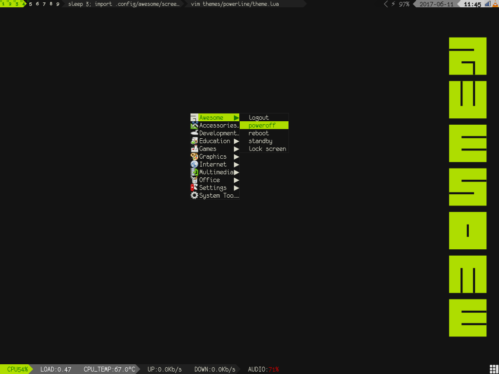

# an awesome powerline theme

### Dependencies
  * powerline (for the upper right widget),
  * properly installed powerline-fonts ("monofur for powerline"),
  * imagemagick for taking screenshots (Print-key) and
  * audiowidget: pulseaudio or thinkpad hardware buttons.

### Extra keys
  * Press ``super+s`` and have look at the "widgets" section,
  * ``super+v`` show the statusbar at the bottom for 5 seconds,
  * ``super+space`` switch the layout __and__ show the statusbar for 5 sec,
  * ``super+c`` show calendar.

### configs
  * Mainly found in the ``config.lua``.
  * The powerline configs are typically located at ``~/.config/powerline/``
    run ``./configure`` to symlink the awesome-powerline json configs into that directory.
    In addition you might have to enable the awesome-powerline in the "ext" section of your
    powerline config (see output of ``configure``).
